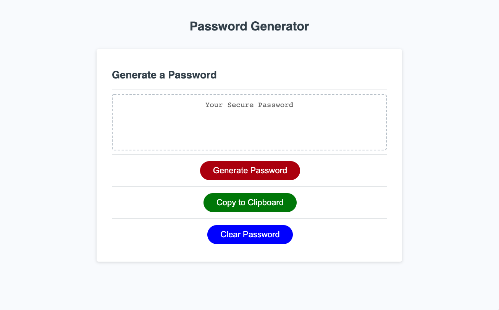

# Random Password Generator

## Description

The motivation for this project was the desire to implement JavaScript functions, arrays, foor loops, and other methods in order to create an interactive webpage.

The reason for building this project was to create a Random Password Geneartor that would create a random password based on desired password criteria and length.

This project solves one major problem. Having to create your own passwords! You no longer have to come up with passwords on your own for the unending online profiles that we create. The random password generator creates a random password between the lenght of 8 and 128. The password can include lowercase, uppercase, numeric, and/or special characters. At least one type of characters must be selected. Once a desired length is input, and the desired type of characters are selected, then a completely random password of the selected length will be created with a random selection of the desired characters.

## Webpage Images

## Installation

No prior installation is required to properly use the Random Password Generator. Simply head to the Deployed link included at the bottom of this README.

## Usage

1. Click on the 'Generate Password' button
1. You will then be prompted for password criteria
    1. Enter a number between 8 and 128 for password length
    1. Click 'OK' for lowercase characters, 'Cancel' for no lowercase characters
    1. Click 'OK' for uppercase characters, 'Cancel' for no uppercase characters
    1. Click 'OK' for numeric characters, 'Cancel' for no number characters
    1. Click 'OK' for special characters, 'Cancel' for no special characters
1. A random password will then be genarated equal to the length input in the first prompt. The password will include random characters based on characters selected.
1. Click the 'Copy to Clipboard' button to copy the password.
1. Click the 'Clear Password' button to clear the password in order to generate another password if needed.

## Deployed Link

https://martinmondaca.github.io/Random_Password_Generator/

## License

Licensed under [MIT](https://choosealicense.com/licenses/mit/) license.
